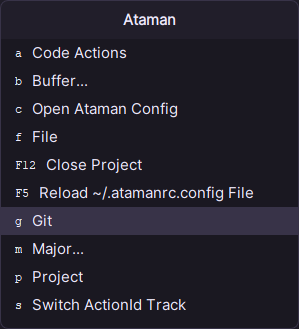
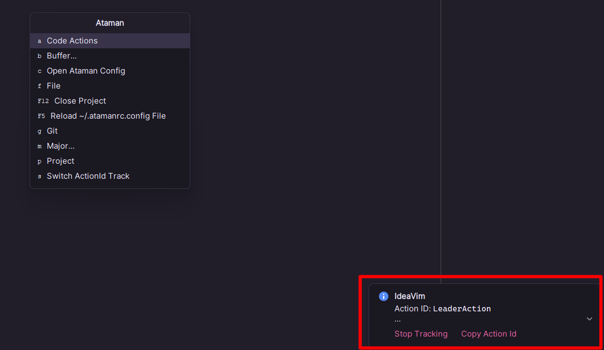

# Spacemacs Key Mapping For Idea

## Plugins

- [IdeaVim](https://github.com/JetBrains/ideavim)
- [Ataman](https://github.com/Mishkun/ataman-intellij)

## How to Use

### Install

#### 1. Add File Soft links
```shell

# clone project to path where you want
git clone https://github.com/leejoker/SpacemacsIdea SpacemacsIdea

cd ~/SpacemacsIdea

# Windows
# use cmd and you should have administrator privilege
mklink %USERPROFILE%\.ideavimrc SpacemacsIdea\.ideavimrc
mklink %USERPROFILE%\.atamanrc.config SpacemacsIdea\.atamanrc.config

# or just copy file to your %USERPROFILE% path

# If on Linux, just use ln -s to make file soft links
```

#### 2. Set Ataman Keymap for IdeaVim

 Change **Ataman: Transparent Leader Key** to **Space** in idea Keymap settings

### Usage

1. Use **Space** to show the menu

    

2. Reload Ataman Config
   
    **Space + F5**

### Custom Configuration

1. Use **Space + c** to modify the config file
2. Add your custom key bindings
3. Use **Space + F5** to Reload the config file
4. If you don't know which actionId to use, use **Space + s** to swith on the actionId track, then you can see the actionId for your executed actions
   

